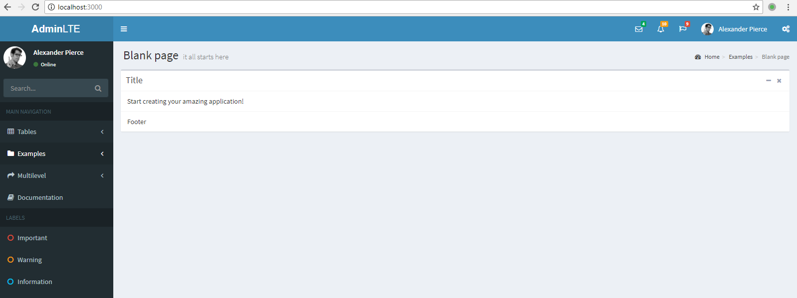

# Examples for Node.js


## [Websocket Example](./websocket)

this example use three type of websocket server implementation

socket.io and sockjs are all implements a weird, arbitrary layer over the WebSocket protocol, which need server side support.


### Server:
sockjs https://github.com/sockjs/sockjs-node  
raw websocket server https://github.com/websockets/ws   
socket.io https://github.com/socketio/socket.io (did not work, no error, no request if use path option, the api is not good)

### Client(Node.js)
https://github.com/websockets/ws  
Server connect to [Echo test](ws://echo.websocket.org) see http://websocket.org/echo.html  

### Client(Browser):
HTML5    https://docs.microsoft.com/en-us/previous-versions/windows/internet-explorer/ie-developer/dev-guides/hh673567(v=vs.85)
https://github.com/sockjs/sockjs-client   
https://github.com/socketio/socket.io-client (the path option did not work)


https://stackoverflow.com/questions/5510537/websocket-library-for-browsers


### Client:  
#### develop:  
use proxy to access express server  
proxy also work with websocket protocol  

### How To Run
#### Server
```shell  
npm run dev  
```

#### Client  
```shell
cd src/client  
npm start  
```

## [Nuxt with Expressjs](./nuxt_express)
Server side rendering by [next.js](https://github.com/nuxt/nuxt.js) associating with expressjs   
using [AdminLTE](https://github.com/almasaeed2010/AdminLTE/) which depend on [bootstrap@3](https://getbootstrap.com/) and [jquery](https://jquery.com/)  
create with template[express-template](https://github.com/nuxt-community/express-template)  
it works much better than next.js and have better document for now. But..., still a tentative way to me. Have not much confidence to use it in real production.
### how to run
go the folder, run ```npm install``` then run ```npm run dev```


## [Next.js with Expressjs](./nextjs_express)
Server side rendering by [next.js](https://github.com/zeit/next.js) associating with expressjs  
using [AdminLTE](https://github.com/almasaeed2010/AdminLTE/)
### The Problem
I have the problem as same as [nextjs custom server build size is too big
](https://stackoverflow.com/questions/48572022/nextjs-custom-server-build-size-is-too-big)
- after ```npm build```, then ```npm start``` which with NODE_ENV = production, the main.js is still 1.2M, and there are hot reloading, it seems the production env did not work.
- there are not much resource to find the answer to eresolve the problem.  

so for now, I will not update the example until there are more progress of the popularity of the next.

## [Miscellaneous Examples](./misc_examples)

### module cycle require
refer to this article [ES modules: A cartoon deep-dive](https://hacks.mozilla.org/2018/03/es-modules-a-cartoon-deep-dive/)  

but we should not mess our code up like such a require relation.
#### Run: 
go into folder misc_examples\src\module_cycle_require
```shell
node .\m_a.js
```

